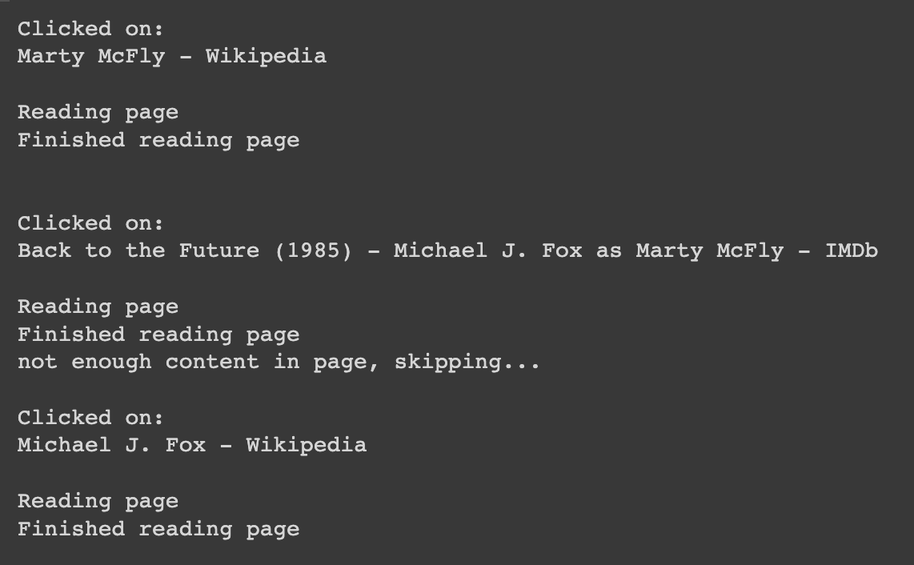
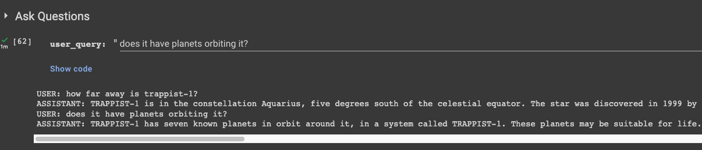

# GPT-browsing-plugin
*A browsing plugin for Huggingface based chat LLM models.*

To use, click on the "Open in Colab" button above.
A copy is also provided under the `notebooks` directory.

I am Loading the smallest open-sourced [Dolly 2.0 model (3B)](https://huggingface.co/databricks/dolly-v2-3b) by default.
I found it very capable with the browsing plugin.
I was not able to try out other similar models because of GPU memory restrictions, but all Huggingface transformers compatible Chat LLM models should work.

There is a field in the notebook to set a model of your choice.

## Browsing Parameters Explanation
`search_topic` - The search topic. This is different from the user questions. This can be things like "Trappist-1 planets", "SVB collapse" etc.

`show_search_results` - When checked, prints out the parsed content that is passed to the LLM.

`snippets_to_use` - The number of search snippets to use for content when `open_links` is uncheked. The model seems to find the snippets very useful for answering questions.

`open_links` - Whether or not to click on search engine results and scrape content from the different pages.

`links_to_open` - The number of pages to click through for content when `open_links` is checked.

`max_page_chars` - Contents approximately greater then this number is truncated. Large numbers may not fit in the GPU, and might make LLM response slower.

`use_wikipedia` - Only uses Wikipedia for the `search_topic` when checked.

`max_wiki_article_chars` - Similar to `max_page_chars`, but for Wikipedia articles.

## Screenshots

*Screenshot of the crawler in action*

*Screenshot of some outputs*

